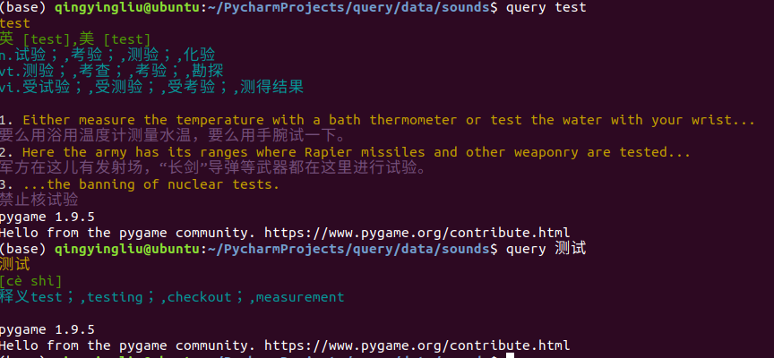
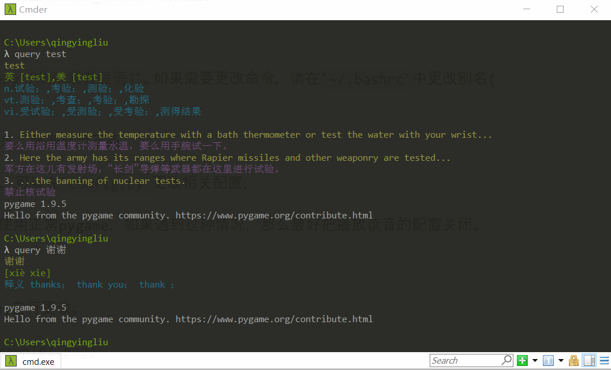
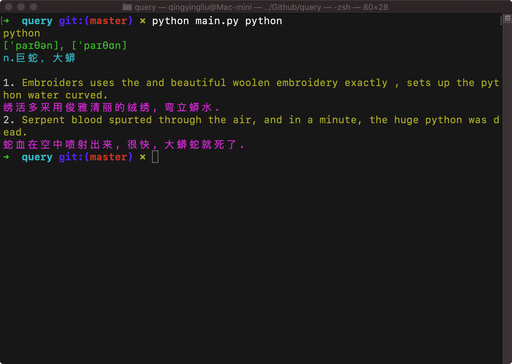

# 有道词典terminal版 3.0

### 使用说明：

1. 默认查询命令是`query [单词或者短语]`。为了方便使用，可以将整个二进制文件软链接到`/usr/local/bin`目录下，实现任何终端都可以运行。 注意，在使用`ln -s`命令时，使用绝对路径取代相对路径，不然可能会出现`too many levels of symbolic links: query`的问题。

2. 如果有例句有显示出来，最多显示5条(可以在config.py设置后重新编译)。

3. 默认发音为英式发音，可以在`config.py`更改相关配置．

### 效果

注： 颜色可以在main.py自行更改。

### 此次更新

1. 将原来使用笨重的Scrapy框架改为轻量级的requests框架，可以加快查询的速度。

2. 优化数据库结构。这里采用python的sqlalchemy来实现ORM数据库模型，从而让模型更加明确，代码更加结构化。

3. 整体优化项目结构．
   
4. 下载单词的json数据，优化了原来xpath解析的方法。

### 目标更新

这个项目是不断改进的项目，从一开始到现在的优化，至少在查询速度方面已经快了很多了，不会让人有等待感（除非网络不好而且没有查询过）。当然，这个项目也不仅仅就到此为止，这里先给出以后更新的设想：

1. 添加查询统计，用来分析自己常用的查询单词。

2. 添加整句翻译。

注意： 该项目仅仅供自己学习和分享给大家学习用途。如果有问题可以通过邮箱联系我：2596736318@qq.com

